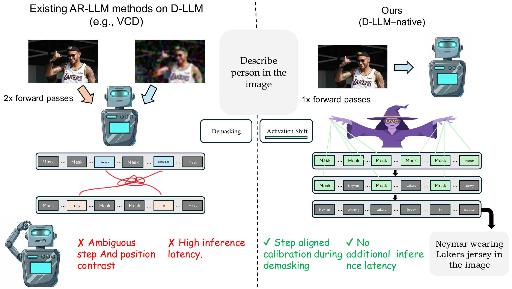
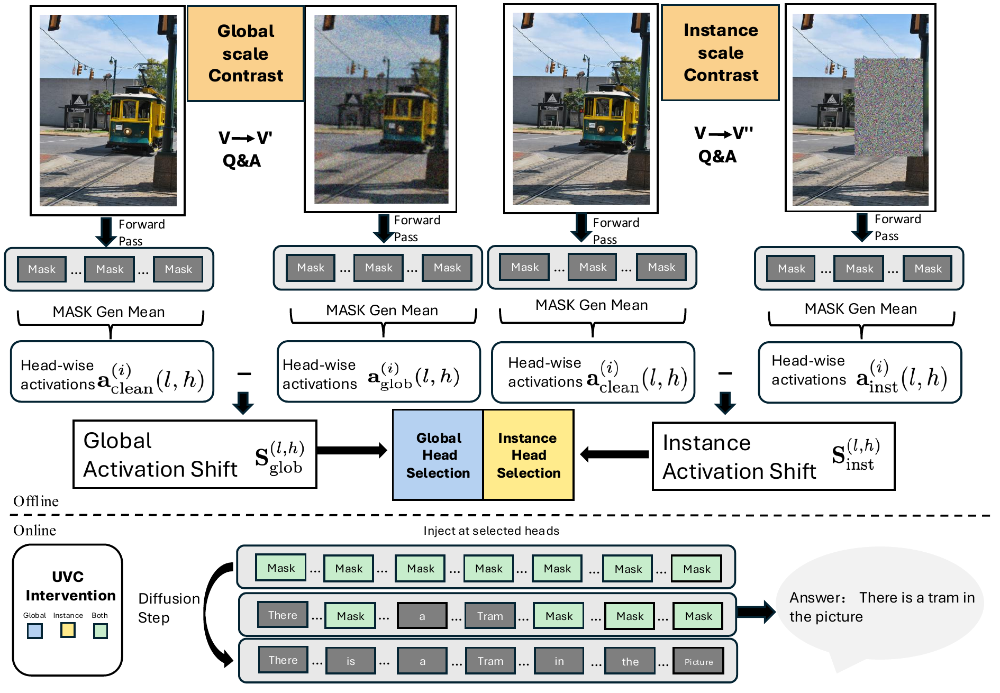

<h1 align="center">UVC: Unmasking-Time Visual Calibration</h1>

<p align="center">
  <b>Hallucination Mitigation in Multimodal Discrete Diffusion Language Models</b>
</p>

This repository contains the official implementation of
**Unmasking-Time Visual Calibration (UVC)**, a lightweight, training-free
framework for mitigating object hallucination in multimodal discrete diffusion
language models. UVC extracts contrastive activation shifts offline, identifies
visually informative attention heads, and injects calibration signals only at
still-masked positions during iterative demasking. The current release includes
vector extraction and evaluation scripts for Lumina-DiMOO and MMaDA on POPE and
MME.

## Overview

UVC calibrates multimodal dLLM inference at unmasking time, avoiding the
extra forward passes and step/position alignment issues of AR-centric
contrastive decoding.

<p align="center">
  
</p>

<p align="center">
  <em>UVC performs D-LLM-native calibration during iterative demasking without an additional contrastive forward pass.</em>
</p>

<br>

The pipeline has three stages:

| Stage | Offline/Online | What it does |
| --- | --- | --- |
| Shift extraction | Offline | Extracts clean-reference, global-scale degraded, and instance-scale degraded activations for the two contrastive shift scales. |
| Head selection | Offline | Ranks attention heads by 2-fold cross-validated ROC-AUC. |
| Mask-aware injection | Online | Adds selected calibration shifts only to still-masked generation positions. |

<br>

<p align="center">
  
</p>

<p align="center">
  <em>Overview of the offline shift extraction, head selection, and online mask-aware intervention workflow.</em>
</p>

## Repository Structure

```text
UVC/
|-- assets/              # README figures
|-- eval/                # POPE and MME evaluation with UVC intervention
|-- get_vector/          # Offline activation vector extraction
|-- LICENSE
`-- README.md
```

## Supported Scripts

| Model | Vector extraction | POPE evaluation | MME evaluation |
| --- | --- | --- | --- |
| Lumina-DiMOO | `get_vector/get_{clean,global,instance}_vector_lumina.py` | `eval/uvc_lumina_pope.py` | `eval/uvc_mme_lumina.py` |
| MMaDA | `get_vector/get_{clean,global,instance}_vector_mmada.py` | `eval/uvc_mmada_pope.py` | `eval/uvc_mme_mmada.py` |

## Environment

UVC builds on the official Lumina-DiMOO and MMaDA implementations. Please first
set up the corresponding model environments and checkpoints following:

- [Alpha-VLLM/Lumina-DiMOO](https://github.com/Alpha-VLLM/Lumina-DiMOO)
- [gen-verse/mmada](https://github.com/gen-verse/mmada)

Then install the extra packages used by the UVC scripts if they are not already
included in the model environments:

```bash
pip install einops numpy scikit-learn tqdm pillow
```

Point the scripts to the local model repositories with environment variables:

```bash
export LUMINA_ROOT=/path/to/Lumina-DiMOO
export MMADA_ROOT=/path/to/MMaDA
```

## Quick Start

### Offline Shift Extraction

UVC uses one clean-reference activation set and two degraded activation sets:
global-scale degradation and instance-scale degradation. The shift vectors used
by inference are computed as `clean - global` and `clean - instance`, matching
the two scales described in the paper. Example commands for Lumina-DiMOO:

```bash
python get_vector/get_clean_vector_lumina.py \
  --model_path /path/to/lumina/checkpoint \
  --image_folder /path/to/images \
  --question_file /path/to/pope.jsonl \
  --output vectors/lumina_clean.npy

python get_vector/get_global_vector_lumina.py \
  --model_path /path/to/lumina/checkpoint \
  --image_folder /path/to/images \
  --question_file /path/to/pope.jsonl \
  --output vectors/lumina_global.npy

python get_vector/get_instance_vector_lumina.py \
  --model_path /path/to/lumina/checkpoint \
  --image_folder /path/to/images \
  --blurred_folder /path/to/instance_degraded_images \
  --question_file /path/to/pope.jsonl \
  --output vectors/lumina_instance.npy
```

MMaDA variants are provided with matching script names:

```bash
python get_vector/get_clean_vector_mmada.py
python get_vector/get_global_vector_mmada.py
python get_vector/get_instance_vector_mmada.py
```

### Evaluation

Run POPE evaluation with global-scale, instance-scale, or combined UVC
intervention:

```bash
python eval/uvc_lumina_pope.py \
  --pope_file /path/to/pope.jsonl \
  --image_folder /path/to/images \
  --model_path /path/to/lumina/checkpoint \
  --clean_vector vectors/lumina_clean.npy \
  --global_vector vectors/lumina_global.npy \
  --instance_vector vectors/lumina_instance.npy \
  --type both \
  --output outputs/lumina_pope_uvc.json
```

For MMaDA:

```bash
python eval/uvc_mmada_pope.py \
  --pope_file /path/to/pope.jsonl \
  --image_folder /path/to/images \
  --model_path /path/to/mmada/checkpoint \
  --clean_vector vectors/mmada_clean.npy \
  --global_vector vectors/mmada_global.npy \
  --instance_vector vectors/mmada_instance.npy \
  --type both \
  --output outputs/mmada_pope_uvc.json
```

MME evaluation scripts are also included:

```bash
python eval/uvc_mme_lumina.py
python eval/uvc_mme_mmada.py
```

## Acknowledgments

We thank the authors of [Lumina-DiMOO](https://github.com/Alpha-VLLM/Lumina-DiMOO)
and [MMaDA](https://github.com/gen-verse/mmada) for releasing their models and
code. UVC uses these models as the multimodal dLLM backbones in our experiments.

## License

This project is released under the Apache License 2.0.
